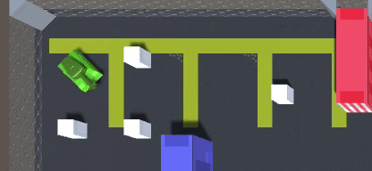
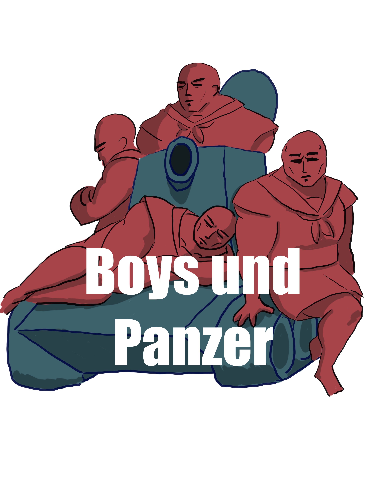

# Welcome to the Boiz Und Panzer Home Page!

# Table of Contents
* [The Team](#team)
* [Game Planning](#game-planning)
* [Current Progress](#current-progress)
* [Game Demos](#demos)
* [Art Designs](#art-designs)

# Team

## Kainalu Kihe (ICS Major)  dkihe@hawaii.edu

- Jahstyn Aweau (ACM Major) jahstyna@hawaii.edu
- Ross Kurizaki (ICS Major) rosskk@hawaii.edu
- John Martinez (ACM Major) john76@hawaii.edu
- Kamren Wakakuwa kamrenw@hawaii.edu

# Game Planning

- 2 - 4 player game where players control a tank and the objective is to be the last tank alive
- Top down view at an angle 
- Tank shells richochet off the walls
- Tanks can only shoot a limited number of projectiles at a time
- Power-ups placed on the map to add new abilities
- Maybe use different tank types with different perks or different shell types
- Different map styles and terrain to offer varying gameplay
- Tanks will be different colors or have unique characters on top to distinguish between players

# Current Progress

## 5/11/2020
- Added background music track
- Adjusted menus
- Updated map powerup positions

## 5/9/2020
- Added start screen
- Created spreadshot powerup
- Recolored tank explosion and fixed barrel hitbox

## 5/8/2020
- Changed aiming raycast to powerup
- Created Shield Powerup

## 4/28/2020
- Fixed bullets going through walls issue
- Adjusted aiming
- Swapped sound effects
- Made win text more readable

## 4/20/2020
- Added aiming raycast

## 4/14/2020
- Adjusted tank movement

## 3/31/2020
- 4 player tank local multiplayer where objective is still to be the last alive
- New map with grass for ground texture and bricks for the walls and additional obstacles
- Bullets reflect on walls twice before disappearing or get destroyed on contact with other bullets
- New tank models
- New bullet models soon to be added
- Win screen with backtick to reset or a on controller

# Demos

## 5/9/2020
- Recolored Tank Deaths

- Added Spreadshot Powerup

- Added Start Screen

## 5/8/2020

## 4/28/2020

## 4/20/2020

## 4/14/2020

## 4/7/2020 Game Layout

## 3/31/2020 Game Layout

## Demo of the Game 3/30/2020
- Added Win screen and way to reset game

- Also Added Bullet bouncing

## Demo of the Game 3/25/2020
- Better rotation for aiming so it doesn't snap to where you look and you have to rotate the gun
- New map implemented

## Demo of the game 3/07/2020
- Multiplayer implemented

## Current Demo of the Game 2/18/20

# Art Designs

## Finalized Logo

## New Ground Textures

## Shipping Container Textures

## New Map layout: Military Base and Shipping Container Area

## Possible Team Logo

## Possible New Map or Next Stage

## Third Tank Design

## New Textures for the Map

## Bullet Design

## New Mockup for Map Layout

## Second Tank Designs

## First Ground and Wall Textures

## First Tank Design

